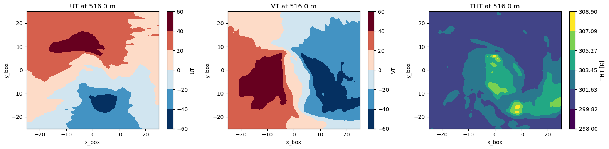
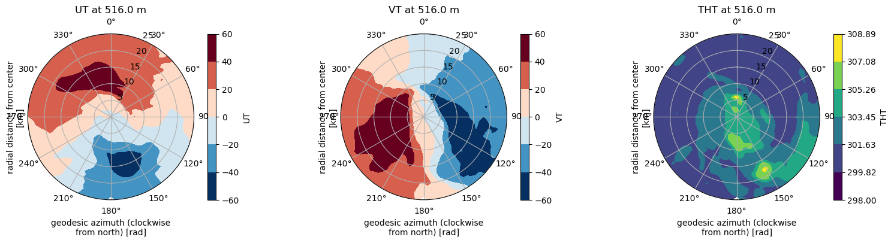

Polar projection with xESMF regridding
======================================

Polar projection using xESMF
----------------------------

Purpose
~~~~~~~
FrameIt can regrid selected model fields onto a storm-centred polar grid defined by radius and azimuth. This is useful to compute azimuthal means, radial profiles, tangential and radial components, and to compare structures consistently along a track.

The workflow is, first, FrameIt extracts and collocates the requested fields on a storm-centred Cartesian box (``x_box``, ``y_box``), second, it builds a geodesic polar target grid (``rr``, ``theta``) around the box centre, third, it interpolates the selected fields onto this polar grid using the `xESMF <https://xesmf.readthedocs.io/>`_ regridding library.

General strategy
~~~~~~~~~~~~~~~~
1. **Define the target polar grid**

   The target grid is parameterised by:

   - **radius** ``rr`` (km), from 0 to ``rmax_km = 0.5 * min(x_boxsize_km, y_boxsize_km)``
   - **azimuth** ``theta`` (degrees), clockwise from North:
     0° North, 90° East, 180° South, 270° West.
   - For each time step, the polar grid points are converted to geographic
     coordinates (lon, lat) using a forward geodesic mapping on the WGS84 ellipsoid.

2. **Interpolate fields onto the polar grid**
   - FrameIt uses xESMF in **LocStream output** mode, which treats the polar grid as a list of target points.
   - Default interpolation is **bilinear**, other xESMF methods can be used if supported by your installation.

3. **Preserve time and vertical dimensions**
   - Interpolation is applied horizontally, vertical coordinates and levels present in the extracted datasets are preserved.
   - FrameIt intentionally projects **all available vertical levels** for the selected variables, it does not apply vertical subsetting at this stage.

Configuration
~~~~~~~~~~~~~
Enable polar projection
^^^^^^^^^^^^^^^^^^^^^^^
Set the following flag in the YAML configuration:

.. code-block:: yaml

  compute_polar_proj: true

Define the polar grid geometry
^^^^^^^^^^^^^^^^^^^^^^^^^^^^^^
The polar grid is derived from the extracted storm-centred box size and the requested polar resolution:

.. code-block:: yaml

  # Box size used during extraction/collocation (km)
  x_boxsize_km: 100
  y_boxsize_km: 100

  # Radial resolution (meters).
  radiale_resolution: 5000

  # Optional azimuthal resolution (degrees).
  # If omitted, FrameIt estimates it from dr_km / rmax_km,
  # with a minimum of 1 degree.
  azimuthal_resolution: 2.0

Notes:
- The last radial point is forced to include ``rmax_km``.
- ``theta`` spans ``[0, 360)`` with step ``azimuthal_resolution``.

Storm tracking mode
^^^^^^^^^^^^^^^^^^^
The behaviour differs depending on the tracking method:

- ``tracking_method: fixed_box``
  - The storm centre is taken at the first time step and kept fixed, the same polar grid is reused for all times.

- Any other tracking method ``wind_pressure, prescribed_track...``
  - The storm centre can move in time, the polar grid is recomputed for each time step.

Selecting variables to project
~~~~~~~~~~~~~~~~~~~~~~~~~~~~~~
Polar projection is applied only to the variables listed in ``polar_variables``. The selection is organised by the same *groups* as the extraction outputs (for example ``surface``, ``level``, ``height`` depending on your configuration).

Example:

.. code-block:: yaml

  polar_variables:
    surface:
      variables: [msl, u10, v10]
    level:
      variables: [u, v, t, q]

Shortcut to project all extracted variables:

.. code-block:: yaml

  polar_variables: all

Important behaviour:
- If vertical selection keys are present inside ``polar_variables`` entries, they are ignored at this stage.
- If a requested variable is missing in a group, it is skipped and reported in logs.

Output structure
~~~~~~~~~~~~~~~~
The polar-projected datasets are returned as a dictionary of xarray datasets, keyed by group. Each dataset typically contains:

- Dimensions: ``time``, ``rr``, ``theta`` (plus any vertical dimensions present in the source data).
- Coordinates:
  - ``rr`` as the physical radius coordinate (km),
  - ``theta`` as azimuth (degrees, clockwise from North),
  - ``lon`` and ``lat`` of the polar grid points (time-dependent if the centre moves),
  - optional diagnostics: ``x_km`` and ``y_km`` (Cartesian offsets in km).

Metadata includes:
- ``polar_proj_backend = "xesmf"``
- ``polar_proj_method`` (for example ``"bilinear"``)
- provenance of requested, source, and output groups.

Derived wind components
~~~~~~~~~~~~~~~~~~~~~~~
If the zonal (``u``) and meridional (``v``) wind components are included in
``polar_variables``, FrameIt automatically computes the radial and tangential
wind components on the polar grid and adds them to the output dataset:

- ``vrad``: radial wind component, positive **outward** from the storm centre.
- ``vtan``: tangential wind component, positive for **clockwise** rotation.

The components are derived from the geodesic azimuth ``theta`` (radians,
clockwise from North):

.. math::

   v_\mathrm{rad} = u \sin\theta + v \cos\theta

   v_\mathrm{tan} = u \cos\theta - v \sin\theta

The target group is ``heightAboveGround`` for AROME and ``level`` for MNH.
If ``u`` or ``v`` are absent from the projected dataset, or if the ``theta``
coordinate is missing, the computation is silently skipped.

``wind_speed`` is also computed on the polar grid by the same rule as for the
Cartesian outputs (see :doc:`/user_guide/output_files`).

Known limitations and caveats
~~~~~~~~~~~~~~~~~~~~~~~~~~~~~
Interpolation and physical interpretation
^^^^^^^^^^^^^^^^^^^^^^^^^^^^^^^^^^^^^^^^^
- **Bilinear interpolation is not conservative**, it is appropriate for smoothly varying fields but can smooth sharp gradients.
- Values at target points outside the source domain are set to **NaN** (unmapped points).
- Close to the storm centre (small radii), the polar sampling can become relatively dense in azimuth compared to the effective source grid spacing, depending on your chosen resolutions.

Grid geometry constraints
^^^^^^^^^^^^^^^^^^^^^^^^^
- The maximum usable radius is limited by the extracted box size:
  ``rmax_km = 0.5 * min(x_boxsize_km, y_boxsize_km)``.
  If your need larger radii, increase the extraction box size accordingly.
- The polar grid is computed using WGS84 geodesics, which is robust at regional scales, but it remains a sampling of geographic coordinates, not a true conformal map projection.

Performance
^^^^^^^^^^^
- If the storm centre moves, FrameIt builds a separate regridder per time step, which can be computationally expensive for long time series and fine polar grids.
- The number of target points is ``nloc = nr * ntheta``, memory and runtime scale with this product and with the number of variables and levels.

Software dependencies
^^^^^^^^^^^^^^^^^^^^^
- Polar projection requires **xESMF** and its backend dependencies (typically ESMF/esmpy). Ensure your FrameIt environment provides a working xESMF installation.

Recommendations for robust usage
~~~~~~~~~~~~~~~~~~~~~~~~~~~~~~~~
- Choose ``radiale_resolution`` comparable to, or slightly coarser than, the native horizontal resolution of your input fields.
- If you omit ``azimuthal_resolution``, verify the inferred value is appropriate for your application, especially for large boxes and coarse ``radiale_resolution``.

Troubleshooting
~~~~~~~~~~~~~~~
- **No output produced**
  - Check ``compute_polar_proj: true`` and that ``polar_variables`` is defined.
  - Ensure the requested group exists in the extracted outputs.

- **Many NaNs on the polar grid**
  - Increase the extraction box size, or reduce ``rmax_km`` by reducing ``x_boxsize_km`` and ``y_boxsize_km``.
  - Verify the storm centre remains inside the extracted box for moving-centre configurations.

- **ImportError for xESMF**
  - Confirm xESMF and its backend are installed in the active environment used to run FrameIt.

Illustration
------------

Here is an illustration for the tropical cyclone CHIDO, first row shows the cartesian coordinates, the second one shows the polar coordinates.

   Example of polar projection.

