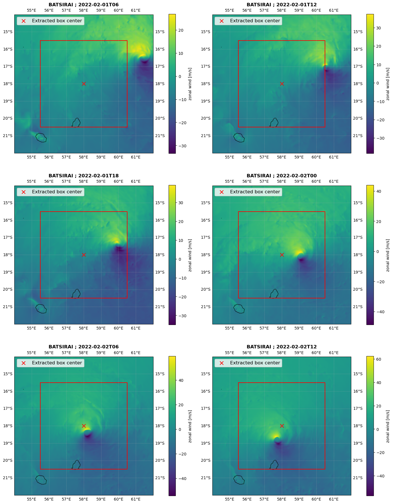

Fixed-box method
================

Overview
--------

The fixed-box tracker (``tracking_method: "fixed_box"``) defines a *time-independent* analysis center.
At all time steps, FrameIt uses the same grid point as the cyclone center, computed once from a user-defined geographic location.

This option is useful when:

- the region of interest is fixed (site-focused diagnostics),
- tracking variables (MSLP, winds) are not available or not reliable.

Inputs and outputs
------------------

Input dataset
~~~~~~~~~~~~~

The model dataset must provide:

- a time coordinate named ``time``,
- latitude and longitude coordinates, either:
  - 1D latitude and 1D longitude (typical AROME-like rectilinear grid), or
  - 2D latitude and 2D longitude (typical Meso-NH curvilinear grid).

Configuration
-------------

Minimal configuration
~~~~~~~~~~~~~~~~~~~~~

.. code-block:: yaml

   tracking_method: "fixed_box"

   # Fixed center location, [lat, lon] in degrees
   fix_subdomain_center: [-17.5, 60.0]

Optional (recommended) parameters
~~~~~~~~~~~~~~~~~~~~~~~~~~~~~~~~~

.. code-block:: yaml

   # Atmospheric model identifier used to interpret the latitude/longitude geometry
   atm_model: "AROME"     # or "MNH"

Key definitions
~~~~~~~~~~~~~~~

``tracking_method``
   Must be set to ``"fixed_box"``.

``fix_subdomain_center``
   Fixed center location given as ``[lat, lon]`` (degrees).

Algorithm
---------

Step 1, read the fixed target location
~~~~~~~~~~~~~~~~~~~~~~~~~~~~~~~~~~~~~~

The tracker reads the target point from the configuration:

.. code-block:: text

   (lat0, lon0) = fix_subdomain_center

Step 2, locate the closest model grid point
~~~~~~~~~~~~~~~~~~~~~~~~~~~~~~~~~~~~~~~~~~~

FrameIt selects the nearest grid point by minimizing a squared distance in latitude/longitude space.

Rectilinear grid (latitude 1D, longitude 1D)
^^^^^^^^^^^^^^^^^^^^^^^^^^^^^^^^^^^^^^^^^^^^^

If latitude and longitude are 1D arrays:

.. code-block:: text

   cy = argmin_j (lat[j] - lat0)^2
   cx = argmin_i (lon[i] - lon0)^2

Curvilinear grid (latitude 2D, longitude 2D)
^^^^^^^^^^^^^^^^^^^^^^^^^^^^^^^^^^^^^^^^^^^^

If latitude and longitude are 2D arrays:

.. code-block:: text

   dist2(j, i) = (lat(j, i) - lat0)^2 + (lon(j, i) - lon0)^2
   (cy, cx) = argmin_{j,i} dist2(j, i)

Step 3, build a time-dependent output
~~~~~~~~~~~~~~~~~~~~~~~~~~~~~~~~~~~~~

The index pair ``(cy, cx)`` is repeated for each model timestamp, producing:

- ``cy(time) = constant``
- ``cx(time) = constant``

Practical considerations and limitations
----------------------------------------

- **Longitude convention**: ensure that the fixed longitude and the dataset longitudes use the same convention (for example ``[-180, 180]`` or ``[0, 360]``). A mismatch can produce an incorrect nearest-point selection.
- **Distance metric**: the method uses a squared Euclidean distance in (lat, lon) space, not a true geodesic distance. This is generally adequate for small domains.
- **Masked coordinates**: if latitude/longitude contain NaNs (masked areas), the minimization must avoid all-NaN distance fields. If all candidate distances are NaN, the selection will fail.
- **Fixed-box versus extraction box**: the fixed-box tracker defines the *center* used by FrameIt.
  The extraction domain size is controlled separately (for example ``x_boxsize_km`` and ``y_boxsize_km``).

Example
-------

.. code-block:: yaml

   atm_model: "AROME"
   tracking_method: "fixed_box"

   fix_subdomain_center: [-18, 58.0]

   x_boxsize_km: 500.0
   y_boxsize_km: 500.0

Illustration
------------

Here is an illustration for the tropical cyclone Batsirai, using the fixed box method.

