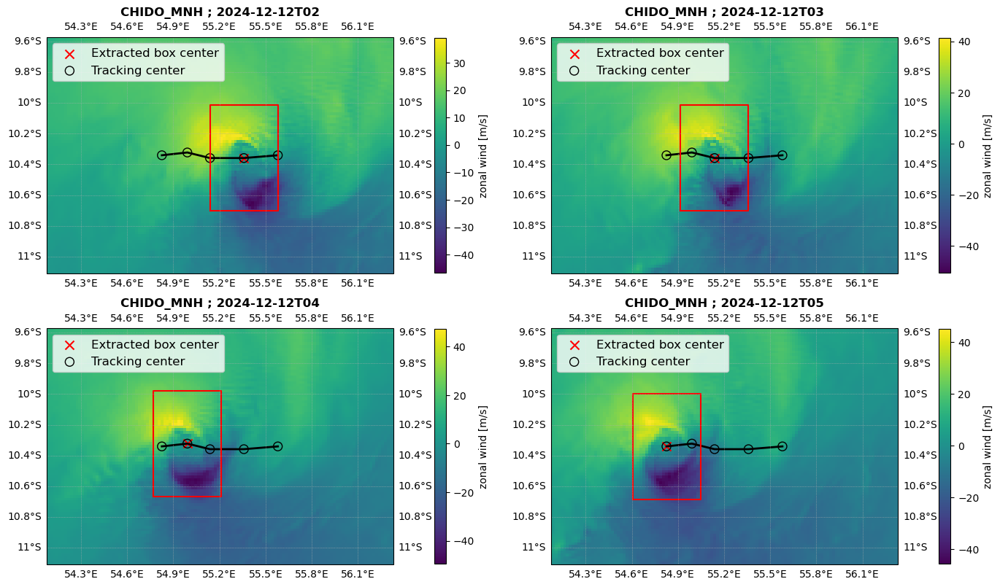

Pressure-wind tracker
=====================

Overview
--------

The pressure-wind tracker (``tracking_method: "wind_pressure"``) estimates the cyclone center at each time step using a sequential two-stage procedure combining:

1. a *pressure-based first guess* from mean sea-level pressure (MSLP),
2. a *wind-based refinement* using the 10 m wind speed magnitude.

The tracker outputs a time series of cyclone center indices ``(cy, cx)`` in the model grid.

Required input fields
---------------------

This tracker requires the following variables to be available in the dataset:

- Mean sea-level pressure (MSLP),
- 10 m zonal wind component,
- 10 m meridional wind component.

Algorithm
---------

Notation
~~~~~~~~

Let:

- ``mslp(t, y, x)`` be the MSLP field at time index ``t``,
- ``u10(t, y, x)``, ``v10(t, y, x)`` be the 10 m wind components,
- ``W(t, y, x) = sqrt(u10^2 + v10^2)`` be the 10 m wind speed magnitude,
- ``(cy_t, cx_t)`` be the cyclone center indices at time ``t``,
- ``half_search`` be the half-width of the MSLP search window,
- ``half_refine`` be the half-width of the wind refinement window.

Sequential procedure
~~~~~~~~~~~~~~~~~~~~

The procedure is defined as follows.

Initialization (t = 0)
^^^^^^^^^^^^^^^^^^^^^^

1. **MSLP first guess**:
   compute the global minimum of MSLP at ``t = 0``, yielding a first-guess index pair
   ``(cy_fg, cx_fg)``.

2. **Wind refinement**:
   build a sub-window centered on the first guess with half-width ``half_refine`` and
   select the minimum of wind speed magnitude ``W`` inside that window.

   - If the refinement sub-window contains only missing values, the wind minimum is
     computed over the full domain.

3. Store the resulting indices as ``(cy_0, cx_0)``.

Tracking for t >= 1
^^^^^^^^^^^^^^^^^^^

For each time step ``t = 1..nt-1``:

1. **Restricted MSLP search around previous center**:
   define a search window centered on ``(cy_{t-1}, cx_{t-1})`` with half-width
   ``half_search`` and compute the minimum of MSLP in that window.

   - If this MSLP sub-window contains only missing values, the MSLP minimum is computed
     over the full domain.

   The corresponding minimum defines the pressure-based first guess ``(cy_fg, cx_fg)``.

2. **Wind refinement around the MSLP first guess**:
   define a refinement window centered on ``(cy_fg, cx_fg)`` with half-width
   ``half_refine`` and compute the minimum of wind speed magnitude ``W`` in that window.

   - If the wind sub-window contains only missing values, the wind minimum is computed
     over the full domain.

3. Store the refined indices as ``(cy_t, cx_t)`` and proceed to the next time step.

Output
------

The core tracking function returns two 1D arrays:

- ``cy(time)``: row index of the estimated center,
- ``cx(time)``: column index of the estimated center,

both returned as integers and packaged in an ``xarray.Dataset``:

.. code-block:: python

   xr.Dataset({"cy": cy, "cx": cx})

Window sizes and conversion from physical radii
-----------------------------------------------

The tracker class defines two physical radii (in kilometers):

- ``SEARCH_RADIUS_KM = 150.0``: MSLP search radius around the previous center,
- ``REFINE_RADIUS_KM = 50.0``: wind refinement radius around the MSLP first guess.

These radii are converted into grid-point half-widths using the grid spacing provided
in the simulation configuration.

Given the grid spacing ``resolution`` (assumed to be in meters in the configuration),
the tracker computes:

- ``resolution_km = resolution / 1000``,
- ``half_search = ceil(SEARCH_RADIUS_KM / resolution_km)``,
- ``half_refine = ceil(REFINE_RADIUS_KM / resolution_km)``,

and enforces a minimum value of 1 grid point for both.

Configuration and usage
-----------------------

To activate this tracker in the YAML configuration, set:

.. code-block:: yaml

   tracking_method: "wind_pressure"

Illustration
------------

Here is an illustration for the tropical cyclone CHIDO, using the wind_pressure tracking method, and a box define by ``x_boxsize_km``: 50.0 and ``y_boxsize_km``: 75.0 
The red line shows the extracted box.

   Example of tracking and extraction using the wind_pressure tracking method.

